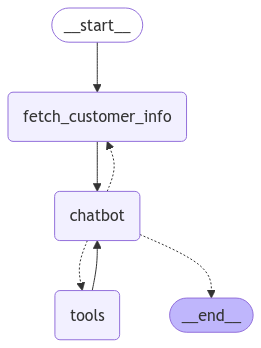

# Contoso Motocorp Service Bot

This repository contains the source code for the Contoso Motocorp Service Bot, implemented as a single agent system using `langGraph`.
It helps customers schedule service appointments, provide feedback, and answer queries related to their vehicles.
It also showcases how we can build agents that can interface with a variety of Vector search technologies. This Bot App uses:
- Azure AI Search to store the embeddings of the vehicle user manual, which is a PDF Document. 
- Azure SQL DatabaseService, an Integrated Vector Database, stores the customer feedback that contains a combination of structured data, like customer provided ratings on aspects like quality of work, timeliness, cleanliness, politeness of the staff. It also stores unstructured data, i.e. the embeddings from the customer provided free flowing text based feedback.

## Project Structure

## Files and Directories

### Root Directory

- **bot-app.py**: Uses a single agent that uses the LLM and the tools action to respond to user /customer input
- **readme.md**: This file.
- **requirements.txt**: List of Python dependencies required for the project.

### Service Requests Directory

These are called by the Agent based on the customer/user input

- **db_tools.py**: Contains database utility functions and tools. 
- **search_tools.py**: Contains tools for performing search-based Q&A.

### Scripts Directory

- **capture-service-rating.sql**: SQL script for the `InsertServiceFeedback` stored procedure.
- **create_service_schedule_sp.sql**: SQL script for the `CreateServiceSchedule` stored procedure. 
- **db-create.sql**: SQL script to create and populate the database tables that can be used to run and demo this application
- **get_embeddings_sp.sql**: Stored Procedure that is used to perform natural language, vector search over the service ratings in the database

### Search data setup

The folder documents contains a PDF which is the user manual of Hero Honda HF100 Bike from the internet. Multimodal data extraction was used to extract insights from the text and images in this document, and the resulting enriched textual data is generated, and saved to file 'heromotocorp-sample-understood.md'. The source code of the multimodal data extraction is not included in this repo.
This could need to be uploaded to Azure AI Search, an index created, a semantic configration created and these parameters populated in the .env file of the app.

### sql-notebooks

This folder contains a jupyter notebook that uses the SQL Kernel. It contains a **Notebook-1.ipynb**
It contains sample code that helps an employee of Contoso Motocorp Service to analyze the customer provided feedback and rating

## Setup

1. **Clone the repository**:
    ```sh
    git clone <repository-url>
    cd <repository-directory>
    ```

2. **Create a virtual environment**:
    ```sh
    python -m venv venv
    source venv/bin/activate  # On Windows, use `venv\Scripts\activate`
    ```

3. **Install dependencies**:
    ```sh
    pip install -r requirements.txt
    ```

5. The .env file

```
AZURE_OPENAI_ENDPOINT="https://<>.openai.azure.com/"
AZURE_OPENAI_API_KEY=""
AZURE_OPENAI_DEPLOYMENT_NAME="gpt-4o"
AZURE_OPENAI_EMBEDDINGS_DEPLOYMENT_NAME="text-embedding-ada-002"
API_VERSION="2023-08-01-preview"
API_TYPE="azure"
az_db_server = "<>.database.windows.net"
az_db_database = "<>"
az_db_username = "<>"
az_db_password = "<>"


ai_search_url = "https://<>.search.windows.net"
ai_search_key = "<>"
ai_index_name = "contoso-motocorp-index"
ai_semantic_config = "contoso-motocorp-config"
```

## Usage

### Running the Bot

To run the bot application, execute the following command:

```sh
python bot-app.py
```

The user can ask the following questions, to explore the Bot
- What are the service appointments available for 15th Jan 2025?
- Can you book the first available slot for my vehicle servicing based on the slots you have shown above?
- I want to take a test ride of the new bike. What are the pre ride inspections I should perform?
- I want to provide feedback on the servicing done for my bike.

### Analyzing Customer Feedback
To analyze customer feedback, run the Jupyter Notebook Notebook-1.ipynb
You can experiment with different conditions when performing a combination of structured and unstructured data input.
Use Azure Data Studio to work with this notebook. See the video below for a demonstration of it.


### Tools and Utilities
#### Database Tools

- fetch_customer_information: Retrieves customer information from the database
- get_available_service_slots: Retrieves available service slots.
- create_service_appointment_slot: Creates a service appointment slot.
- store_service_feedback: Stores customer feedback for a service appointment.

### Graph comprising the Agents

bot-app.py -> implements a simple, single agent solution using `langGraph`. Here the agent that invokes the appropriate tool required to service a customer request/input.
The graph looks as shown below:




See a demo of this App: [demo](https://youtu.be/QSEe6Z56TBo)

